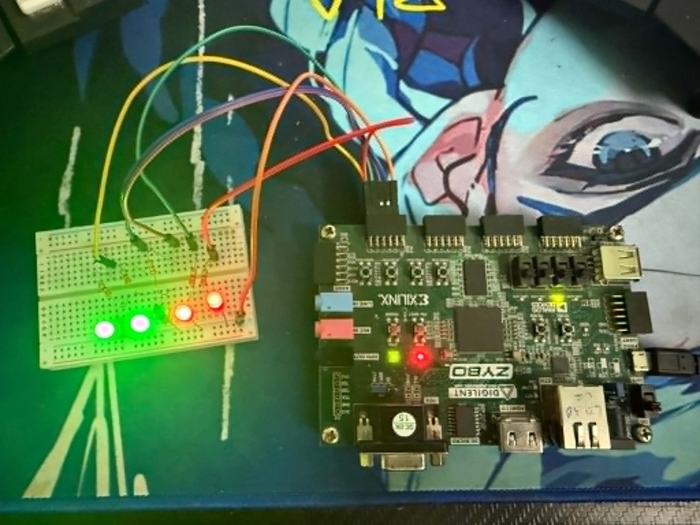

# RV32I + Custom ROL on Zybo



A 5-stage pipelined RV32I processor with a custom rotate-left instruction,
written in Verilog, simulated with Icarus, and synthesized to a Digilent Zybo
(Zynq-7010, original revision) running at 125 MHz.

The interesting bits, briefly:

- Full RV32I base ISA, 5-stage pipeline (IF/ID/EX/MEM/WB).
- Hazards handled: EX/MEM and MEM/WB forwarding, load-use stall, branch/jump
  flush. CPI is 1.09 on the included hazard test and 1.14 on the Fibonacci
  benchmark.
- A single custom instruction, `ROL`, sitting in the `custom-0` opcode space
  (0001011). One-cycle 32-bit barrel rotation. Used by the ChaCha20 benchmark
  to replace a 3-instruction shift/shift/or sequence with a single op.
- Memory-mapped GPIO at address `0x100`. Five LEDs on PMOD JB, driven by
  software stores from the CPU.
- Reset is debounced through a 4-stage synchronizer with a 16-cycle power-on
  hold, so the CPU comes up cleanly without an external reset network.

## Repository layout

```
src/                 RV32 core RTL and program hex files
tb/                  testbenches (top, ALU, regfile, benchmark, crypto)
fpga/
  rtl/zybo_top.v     board wrapper: pin mapping, reset sync, LED diagnostics
  constraints/       XDC pin assignments
docs/                project guide (PDF + markdown), RISC-V card
sim/                 simulation binaries and waveform dumps
scripts/             helpers (gen_crypto_hex.py, gen_pptx.py)
deliverables/        report, presentation
zybo_blink/          standalone Vivado project used for board bring-up
```

`top.v` is the simulation top and instantiates the whole core. `zybo_top.v`
wraps it for the FPGA build, mapping physical pins and exposing internal CPU
state on the on-board LEDs so synthesis can't optimize the design away.

## Memory map

The address space the CPU sees is small but enough for the demos:

| Range            | What it is                            |
|------------------|---------------------------------------|
| `0x000` – `0x0FF`| 64-word data memory (BRAM)            |
| `0x100`          | GPIO register (5 bits, write-only)    |

Storing to `0x100` does not go to RAM. `dmem` decodes the address and instead
writes the low five bits to a register that drives PMOD JB.

Instruction memory is a separate 64-word BRAM, initialized at synthesis time
from `src/program.hex` via `$readmemh`.

## Running in simulation

```
iverilog -o sim/hazard_test     src/*.v tb/top_tb.v       && vvp sim/hazard_test
iverilog -o sim/benchmark_test  src/*.v tb/benchmark_tb.v && vvp sim/benchmark_test
iverilog -o sim/crypto_test     src/*.v tb/crypto_tb.v    && vvp sim/crypto_test
```

The benchmark testbench prints the perf counters and a CPI summary. The crypto
testbench runs the ChaCha20 implementation in both software (RV32I-only) and
hardware (custom ROL) form, verifies the outputs match, and reports the
instruction count delta.

Waveforms drop into `sim/*.vcd` for viewing in GTKWave.

## Running on the Zybo

You need Vivado 2019.1, the Digilent board files, and the cable drivers. Once
those are in place, the project at `fpga/zybo_rv32/` opens with everything
already wired up:

1. Open `fpga/zybo_rv32/zybo_rv32.xpr` in Vivado.
2. Generate Bitstream (re-run synthesis if you have edited any source).
3. Open Hardware Manager, Auto Connect, Program Device.

The bitstream is volatile — each cold-boot you need to JTAG it back. To make
it persistent, build a `BOOT.bin` in Xilinx SDK (FSBL plus bitstream) and
either program QSPI flash or drop it on a microSD; flip JP5 to match.

### What the LEDs mean

Onboard, top-level diagnostics:

| LED | Source              | What it tells you                          |
|-----|---------------------|--------------------------------------------|
| LD0 | `perf_halted`       | solid on once the CPU hits a halt loop     |
| LD1 | `perf_cycles[26]`   | clock heartbeat, ~1 Hz                     |
| LD2 | `perf_instrs[26]`   | toggles as instructions retire             |
| LD3 | `pc_out[28]`        | toggles as the PC advances                 |

PMOD JB carries the five GPIO bits the program writes via MMIO. The default
program is a rotating 5-bit pattern (10111 → 01111 → 11110 → 11101 → 11011)
with a 2-second hold per step, so you should see exactly one LED dark at any
moment, walking position by position.

Pin map for JB (use the listed pins for an external 5-LED breadboard):

| Bit       | JB header pin | Zynq pin |
|-----------|---------------|----------|
| `gpio[0]` | JB1           | T20      |
| `gpio[1]` | JB2           | U20      |
| `gpio[2]` | JB3           | V20      |
| `gpio[3]` | JB4           | W20      |
| `gpio[4]` | JB7           | Y18      |

330 Ω in series with each LED. Common cathodes to either of the GND pins
(JB5 or JB11).

## Why a wrapper instead of synthesizing `top` directly

`top.v` was written for simulation: its only ports are `clk` and `reset`, and
nothing inside it drives an external pin. If you hand it to Vivado as the
synthesis top, the tool sees no observable outputs and is happy to optimize
the entire CPU into nothing. `zybo_top.v` solves that by exposing a few
internal signals (perf counters, PC, GPIO register) to physical pins via the
on-board LEDs and PMOD. Once those signals are pinned down, synthesis has
no choice but to keep the logic that produces them, which is the whole core.

## Custom ROL, the short version

The `custom-0` opcode space (`7'b0001011`) is reserved by the RISC-V spec for
extensions exactly like this. The control unit decodes it as an R-type and
hands ALU control code `4'b1010` to the ALU, which computes
`(src1 << src2[4:0]) | (src1 >> (32 - src2[4:0]))` in one cycle.

It matches the semantics of `rol` in the standard Zbb (Bitmanip) extension —
we just placed it in custom space rather than reimplementing the Zbb encoding.
The ChaCha20 benchmark is the canonical case: each quarter-round has four
rotations, going from 12 instructions in software to 4 in hardware, and the
loop body shrinks from 22 to 14 instructions.

See `docs/PROJECT_GUIDE.md` for the longer write-up, including pipeline
diagrams, hazard examples, the ROL ChaCha20 numbers, and a tour of every
file in `src/`.
